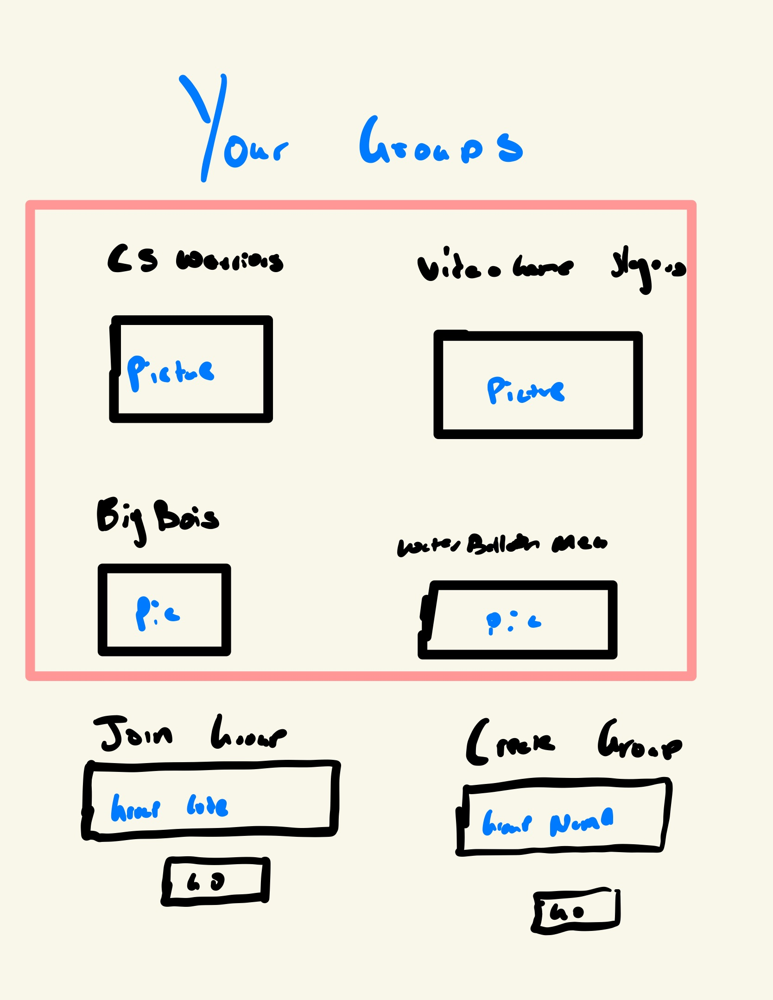

# Yappersville

## Elevator Pitch
Do you and your buddies want a place to talk after school, and don't know where to go? Group messaging isn't as fun especially when you guys have different phones, and let's be honest within group messaging you don't have the freedom to make the groups and circles of friends you really want. That's why we are here to introduce Yapperville. A full-fledged chat application where you can create groups, join groups and chat with a host of people both publicly and privately.

## Design

## Key features

- Secure login over HTTPS
- Ability to chat in real time with friends
- Ability to create groups with codes to chat with your friends
- Ability to private message people

## Technologies

### I am going to use the required technologies in the following ways:

#### HTML
- Uses correct HTML structure for the application. One page to handle logins. One page to join a group via a code, or join an existing group. Another page to chat within the groups. Lastly, a page to private message people.

#### CSS
- Application styling that looks good on different screen sizes, uses good whitespace, color choice and contrast.

#### JavaScript
- Provides login, will provide the functionality to actually be able to type and chat. Allow for interactions between the user and UI for instance clicking on someone to private message them. Allow for interaction between pages.

#### Service
- Backend service with endpoints for:
  - login
  - retrieving chats
  - putting a new chat in
  - creating a new group

#### DB
- Store users, store chats, and store groups

#### Login
- Register and login users. Credentials securely stored in the database. Can't interact with our application without login. So no chatting or group joining.

#### WebSocket
- Instant update of chats when people are talking in groups or private message.

#### React
- Application ported to use the React web framework.

Link to notes : https://github.com/ben-m2002/startup/blob/main/notes.md
